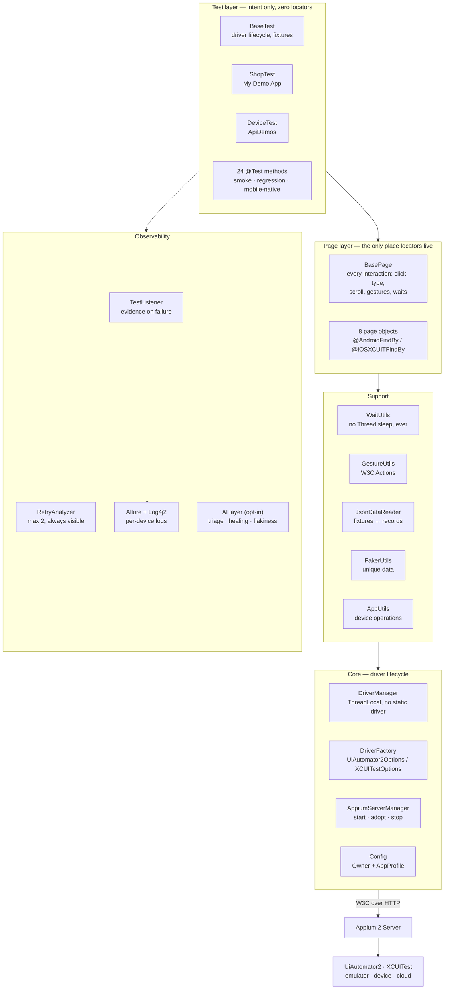
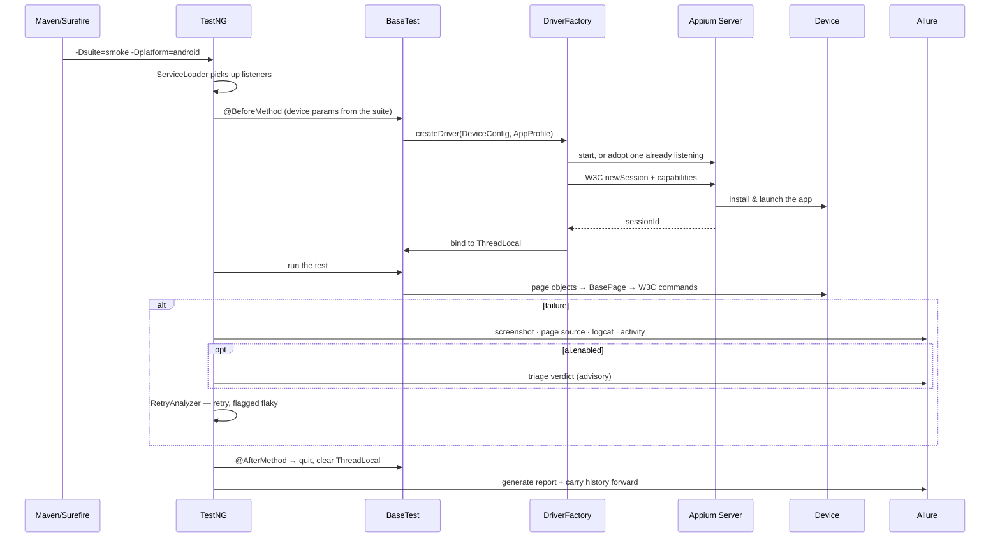

# Mobile Automation Framework

**Appium 2 test automation for Android and iOS — built so a failure tells you what broke, not just that something did.**

[](https://github.com/Adarsh89P/mobile-automation-framework/actions/workflows/mobile-tests.yml)
[](https://adoptium.net/)
[](https://appium.io/)
[](https://testng.org/)
[](https://allurereport.org/)
[](LICENSE)

24 tests across three suites, driving two real applications on Android, with iOS wired but not
executed. 8 page objects, 95% accessibility-id locators, zero `Thread.sleep`.

---

## Five engineering decisions

- **One driver per thread, one session per test.** `ThreadLocal<AppiumDriver>` with no static
  driver anywhere. A shared session makes tests order-dependent — the second starts wherever the
  first left the app — and under `parallel="tests"` two threads would drive one session. A fresh
  session costs ~15s and buys tests that run individually, in any order, in parallel.
- **Retries are loud, never silent.** `IAnnotationTransformer` applies a max-2 retry policy to
  every test without a single annotation, and each retried attempt is flagged flaky in Allure
  with the reason. A framework that hides retries is a framework that lets product bugs through
  as "just flaky".
- **Flakiness is ranked by status flips, not failure rate.** A test that fails 20 times out of 20
  is broken, not flaky. Ranking by failure rate buries the genuinely unstable tests underneath
  the consistently broken ones.
- **The AI layer cannot change a result.** Flag-gated, key from the environment only, every call
  returns `Optional` and never throws. Locator self-healing *suggests* by default and rethrows the
  original failure — self-healing that silently keeps a suite green is how a team stops noticing
  that its locators no longer describe the product.
- **Test data came out of the app, not out of my head.** Credentials, error messages and all six
  product descriptions were extracted from the app's own JS bundle, so the assertions match what
  the app actually renders. Prices, which the app fetches from a backend, are marked for
  confirmation rather than guessed.

---

## Architecture



### Execution flow



---

## Project layout

```
├── pom.xml                          Java 17 · Selenium pinned to 4.34.0 (see the comment inside)
├── Jenkinsfile                      Parameterised pipeline mirroring the GitHub workflow
├── scripts/fetch-apps.sh            Downloads app binaries too large to commit
├── .github/workflows/
│   └── mobile-tests.yml             PR → smoke · nightly → regression · Pages trend charts
└── src/test/
    ├── java/com/adarsh/
    │   ├── core/                    Driver lifecycle — no static driver exists in this repo
    │   │   ├── DriverManager        ThreadLocal<AppiumDriver>, safe quit
    │   │   ├── DriverFactory        Typed Options builders, local/grid/cloud
    │   │   ├── AppiumServerManager   Starts a server, or adopts one already running
    │   │   ├── DeviceConfig          Everything parallel sessions must not share
    │   │   └── PlatformType · ExecutionTarget · CloudProvider
    │   ├── config/                  Owner-backed typed config
    │   │   ├── FrameworkConfig       MERGE policy → -D overrides are per-key
    │   │   ├── ConfigReader          Single entry point, resolved once
    │   │   └── AppProfile            Per-app identity; suites can switch apps per <test>
    │   ├── pages/                   The only place locators live
    │   │   ├── BasePage              All 14 interactions; UiScrollable on Android
    │   │   └── Login · ProductList · ProductDetails · Cart · Checkout · Menu · ApiDemosHome
    │   ├── models/                  Records deserialised from fixtures
    │   ├── utils/                   Waits · W3C gestures · JSON · Faker · screenshots · device
    │   ├── listeners/               Retry policy, evidence capture, Allure wiring
    │   ├── ai/                      Opt-in: triage, locator healing, flakiness ranking
    │   └── tests/                   24 tests — intent only, zero locators
    └── resources/
        ├── config/                  android · ios · log4j2 (per-device routing) · apps/
        ├── suites/                  smoke · regression · mobile-native · parallel-devices
        ├── testdata/                Fixtures extracted from the app itself
        ├── apps/                    ApiDemos committed; My Demo App fetched on demand
        └── META-INF/services/       Listener registration — a new suite cannot forget them
```

---

## Environment setup

### 1. JDK 17

```bash
# macOS
brew install --cask temurin@17
# Ubuntu
sudo apt install openjdk-17-jdk
# Verify
java -version    # 17.x
mvn -version
```

A newer JDK works for local runs — the build targets `--release 17`, so the bytecode is Java 17
either way. CI provisions 17; do not raise `maven.compiler.release` without also raising the
workflow, or the build passes locally and fails on the runner.

### 2. Android SDK

```bash
# Android Studio, or command-line tools only:
export ANDROID_HOME=$HOME/Android/Sdk
export PATH=$PATH:$ANDROID_HOME/platform-tools:$ANDROID_HOME/emulator:$ANDROID_HOME/cmdline-tools/latest/bin

sdkmanager "platform-tools" "platforms;android-34" "system-images;android-34;google_apis;x86_64"
avdmanager create avd -n Pixel_7_API_34 -k "system-images;android-34;google_apis;x86_64" -d pixel_7
emulator -avd Pixel_7_API_34 &
adb devices -l          # confirm it is attached and booted
```

### 3. Appium 2 and the driver

```bash
npm install -g appium@2.11.3
appium driver install --source=npm appium-uiautomator2-driver@3.7.6
appium driver list --installed

# Environment sanity check
npm install -g appium-doctor && appium-doctor --android
```

The framework **starts and stops the Appium server itself**, so you do not need one running. If
you prefer your own (faster debug loop), start it and pass `-Dappium.server.reuse=true`.

### 4. Apps under test

`ApiDemos-debug.apk` is committed — the smoke suite runs straight after a clone. The 32 MB Sauce
Labs demo app is fetched on demand:

```bash
./scripts/fetch-apps.sh
```

### 5. Point the config at your device

Edit `src/test/resources/config/android.properties` — `device.name`, `platform.version` and
`udid` are marked `TODO` — or override per run with `-Ddevice.name=...`.

### 6. iOS (configured, not executed)

Everything for iOS is wired: `XCUITestOptions`, `@iOSXCUITFindBy` on every locator, a `wdaLocalPort`
per parallel session, and an `ios.properties` profile. It is **not run in this repo** — there is no
macOS runner. Enabling it needs Xcode, `xcode-select --install`, the XCUITest driver, and the
simulator build unzipped into `src/test/resources/apps`.

---

## Running the tests

```bash
# The build gate
mvn test -Dsuite=smoke -Dplatform=android

# Everything (nightly)
mvn test -Dsuite=regression -Dplatform=android

# Device capabilities: rotation, backgrounding, deep links, connectivity, gestures
mvn test -Dsuite=mobile-native -Dplatform=android

# Several devices at once — one <test> block per device, unique driver ports
mvn test -Dsuite=parallel-devices

# Override anything: system properties beat the properties file, per key
mvn test -Dsuite=smoke -Ddevice.name=Pixel_7_API_34 -Dudid=emulator-5554 -Dapp=mydemo

# Reuse a server you started yourself
appium --port 4723 &
mvn test -Dsuite=smoke -Dappium.server.reuse=true

# Device cloud (credentials from the environment only)
export BROWSERSTACK_USERNAME=... BROWSERSTACK_ACCESS_KEY=...
mvn test -Dsuite=smoke -Dexecution=cloud -Dapp.path=bs://<hash>

# Report
mvn allure:report && mvn allure:serve
```

| Property | Default | Purpose |
|---|---|---|
| `suite` | `smoke` | Which file in `src/test/resources/suites` |
| `platform` | `android` | `android` \| `ios` — also selects the properties file |
| `execution` | `local` | `local` \| `grid` \| `cloud` |
| `app` | `apidemos` | Which profile in `config/apps` |
| `device.name` / `udid` | see properties | Target device |
| `appium.server.reuse` | `false` | Attach to a running server instead of starting one |
| `record.video.on.failure` | `false` | Record the screen; costs runtime |
| `retry.count` | `2` | Retries before a test is called failed |
| `ai.enabled` | `false` | Opt into the AI layer (needs `ANTHROPIC_API_KEY`) |

---

## Reporting

Every failure carries the four things triage actually asks for: **what the screen looked like**
(screenshot), **what the app thought was on it** (page source), **where in the app we were**
(package + activity), and **what the device said** (logcat tail). Optionally a screen recording.

Retried tests are flagged `flaky` with the reason, so the flakiness view and trend charts show
instability instead of hiding it behind a green tick.

```
$ mvn allure:report

TEST                                                  RUNS   PASS   FAIL FLAKINESS  VERDICT
--------------------------------------------------------------------------------------------
CartTest.quantityRecalculates                            5      2      3      100%  HIGHLY FLAKY
CatalogTest.scrollToLast                                 5      4      1       50%  FLAKY
CheckoutTest.placeOrder                                  5      0      5        0%  BROKEN (always
                                                                                    fails - not
                                                                                    flaky)
```

<!-- TODO: add a screenshot of the generated report to docs/screenshots/allure-overview.png and
     link it here. Generate one with: mvn test -Dsuite=smoke && mvn allure:serve -->

---

## CI strategy

| Trigger | Suite | Why |
|---|---|---|
| Pull request | `@smoke` | A gate nobody waits for is a gate everybody bypasses |
| Nightly (02:00 UTC) | `@regression` | Depth where the wall-clock cost is free |
| Manual dispatch | any | Choose suite, API level, video recording |

The workflow enables KVM (without it the emulator is roughly 10× slower), caches the AVD snapshot
and the app binaries, and runs every reporting step under `if: always()` — a report that only
appears on green is a report that never appears when you need it. Allure history is carried
through the `gh-pages` branch, which is what makes the trend charts accumulate.

A parameterised `Jenkinsfile` mirrors it, because most enterprise device labs are on-premises.

---

## Design decisions and trade-offs

| Decision | Trade-off accepted |
|---|---|
| One session per test | ~15s per test. Bought: order-independence and safe parallelism |
| Accessibility id first, XPath never | Needs testIDs in the app. 0 XPath locators; 95% accessibility id |
| `UiScrollable` for Android scrolling | Android-specific. One round trip, and it knows when the list ends |
| One `CheckoutPage`, not four | Less granular. It is a wizard you cannot enter halfway; four classes is ceremony |
| Explicit waits only, implicit set to zero | More code per lookup. Implicit waits silently corrupt every explicit wait they overlap |
| Selenium pinned to 4.34.0 | Manual bump on upgrade. `java-client` uses an open range and Selenium keeps deleting classes it implements |
| ApiDemos for device tests | Two apps to manage. Platform behaviour cannot fail because a vendor redesigned a screen |
| Fixtures over generated data | Fixtures need updating. The app must echo exact strings; Faker covers only what must be unique |
| AI is advisory, healing suggests only | Fewer green runs. An AI that can turn a test green can hide a product bug |

### Known gaps

- **iOS is configured but never executed** — no macOS runner. Treat the iOS locators as untested.
- **Six locators are marked `TODO: confirm with Appium Inspector`** — extracted from a minified JS
  bundle where they could not be isolated with certainty. The rest were verified.
- **Product prices are unverified** — the app fetches them from a backend, so `products.json`
  carries the widely published values and a note to confirm them on first run.
- **The AI layer has not made a live API call** — its disabled and degraded paths are tested; the
  request shape follows the SDK reference but is unproven against the endpoint.

---

## What I would add next

1. **A locator-drift check in CI.** Nightly, dump the page source of each key screen and diff the
   accessibility ids against the ones the page objects use. Locator rot is discovered by a failing
   test today; it should be discovered by a diff.
2. **Visual regression** on a handful of screens. Layout breakage passes every assertion here.
3. **A real device cloud in the nightly run.** Emulators do not reproduce OEM skins, low memory,
   or a real network — where mobile bugs actually live.
4. **Accessibility assertions.** The suite already leans on accessibility ids; asserting labels,
   contrast and touch-target size is a small step from there and catches real defects.
5. **Quarantine automation.** Feed `flakiness-report.json` back into the suite so a test above a
   threshold is auto-quarantined and ticketed, instead of quietly eroding trust in the run.
6. **Performance budgets** — app launch and screen transition timings, asserted against a budget
   and trended, so a regression is a failing test rather than a user complaint.

---

## License

MIT — see [LICENSE](LICENSE).
