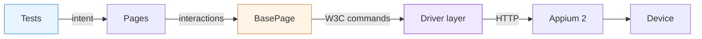
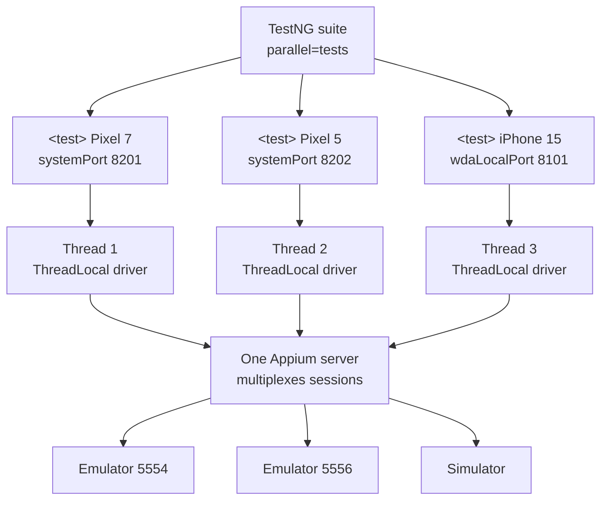
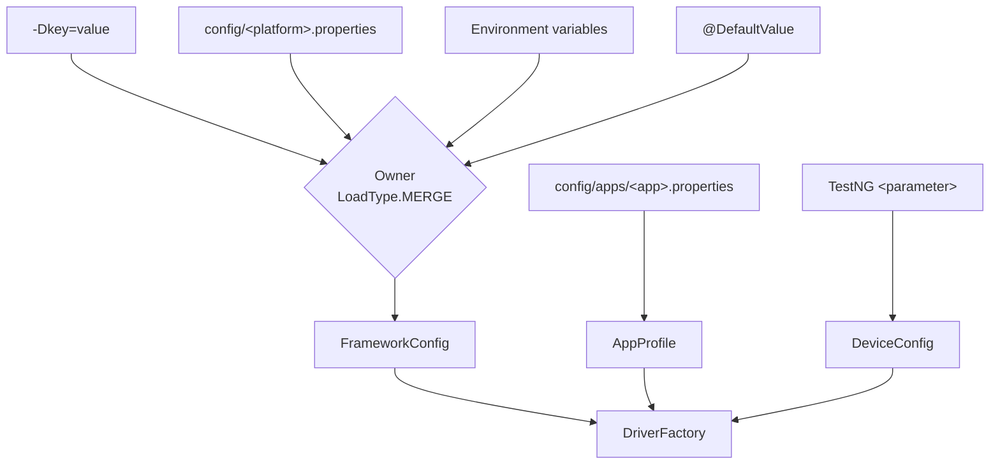
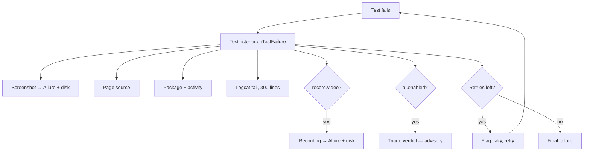

# Architecture

Companion to the [README](../README.md). The README says what the framework does; this says how
it is put together and why each piece is shaped the way it is.

---

## 1. Layers, and the rules between them

Three rules hold the layering together, and each is mechanically checkable:

| Rule | Why | How it is verified |
|---|---|---|
| Tests contain zero locators | A locator in a test is a locator in forty tests | `grep` for `AppiumBy`/`By.` under `tests/` |
| Pages return page objects or data, never `WebElement` | Returning an element leaks the driver into the test layer | Reflection over every public page method |
| Only `BasePage` touches the driver | Waiting, logging and keyboard handling are written once | `driver.` appears in page classes only via `BasePage` helpers |

The reflection check also asserts that every page declares a load marker and that every element
field carries a locator annotation. Every check passes as of the last run: **0 XPath locators, 59/62 (95%) accessibility id**.

---

## 2. Threading model

The single most important design constraint. TestNG runs `<test>` blocks in parallel, so anything
shared between them is a race.

What is shared and what is not:

| Shared across threads | Per thread | Why |
|---|---|---|
| `FrameworkConfig` (read-only) | `AppiumDriver` | A shared driver means two threads on one session |
| One Appium server | `systemPort` / `wdaLocalPort` | Two sessions on one UiAutomator2 port fail intermittently |
| Parsed JSON fixtures (immutable records) | `Faker` instance | Faker is not documented as thread-safe |
| Retry attempt counters (concurrent map) | Log4j `ThreadContext` | Routes each device's log to its own file |

`DriverManager.quitDriver()` removes the `ThreadLocal` entry in a `finally` block. Without that,
a pooled thread carries a dead driver into the next test — a failure that appears one test later
than its cause, which is the hardest kind to diagnose.

---

## 3. Configuration resolution

Three deliberate choices:

- **`LoadType.MERGE`, not Owner's default `FIRST`.** Under `FIRST`, the first source that exists
  wins *entirely* — so a single `-D` flag would make the whole properties file invisible. MERGE
  makes the override per-key, which is what "system properties override file values" means.
- **App identity lives outside `FrameworkConfig`.** Owner resolves an interface once per JVM, but
  a suite switches apps per `<test>` block, so `AppProfile` is loaded on demand and cached per
  name + platform.
- **Anything two parallel sessions would collide on lives in `DeviceConfig`**, passed explicitly
  rather than read from global config.

Secrets have no defaults and appear in no committed file. Cloud credentials and the Anthropic key
are read from the environment or not at all.

---

## 4. Waiting

There is no `Thread.sleep` in the repository, and the reason is not stylistic: a sleep is either
too short (flaky) or too long (slow), and across a suite it is reliably both.

Every wait goes through `WaitUtils`, which:

- ignores `StaleElementReferenceException` — React Native rebuilds the view hierarchy on each
  render, so an element found a moment ago being replaced mid-wait is normal, not an error;
- rewrites the timeout message to say what was being waited for. Selenium's default quotes a raw
  proxy string; *"Timed out after 20s waiting for the cart badge to read 2"* is the difference
  between triaging from the report and re-running on a borrowed device;
- exposes `waitUntil(BooleanSupplier, description)` as the escape hatch, so a page needing a
  bespoke condition still never reaches for a sleep.

The implicit wait is set to `Duration.ZERO` at session creation. A non-zero implicit wait silently
changes the meaning of every explicit wait it overlaps and makes negative assertions crawl.

---

## 5. Failure pipeline

Two subtleties, both discovered by running it rather than by reading the docs:

1. **Allure finalises a result during `onTestSuccess`/`onTestFailure`.** Listener order between two
   `ITestListener`s is not guaranteed, so updates made there are frequently applied to a result
   that has already been written — and vanish silently. The flaky flag is therefore set from
   `afterInvocation` and from the retry decision, the last points where the test case is still
   mutable.
2. **TestNG never calls `onTestFailure` for a `@BeforeMethod` failure.** A driver that will not
   start produces a pile of skipped tests and no stated reason. `IConfigurationListener` covers
   that case explicitly.

---

## 6. Retry policy

`RetryTransformer` (an `IAnnotationTransformer`) attaches `RetryAnalyzer` to every test, so the
policy is declared once and a new test is covered the moment it is written. Attempts are counted
per *invocation* including parameters — a data-driven test must not have one bad row exhaust the
retry budget of the others.

Every attempt is flagged, including the intermediate ones TestNG records as skipped. An unflagged
skip is indistinguishable from a test that was never meant to run, which is exactly how retries
end up hiding intermittent failures.

---

## 7. AI layer

Three features, one hard constraint: **nothing here may change whether a test passes.**

| Feature | Input | Output | Model call? |
|---|---|---|---|
| Failure triage | Error, trimmed page source, last step | Category + confidence, attached to Allure | Yes |
| Locator healing | Failed locator + page source | Suggestion in `healing-report.json` | Yes |
| Flakiness ranking | Allure history across runs | Ranked report + table | **No** — arithmetic only |

Guards, in order: `ai.enabled` off by default → `ANTHROPIC_API_KEY` absent disables it → every
call returns `Optional` → every call site is additionally wrapped. Locator healing **suggests and
rethrows the original failure**; retrying with a suggested locator requires `ai.healing.apply=true`
and is off in CI, because a test that passes on an AI-supplied locator is a test that no longer
tells you the truth about your page objects.

---

## 8. What is verified, and what is not

Honest accounting, since no device was attached while this was built:

| Verified by running it | Not verified |
|---|---|
| Config resolution, `${platform}` expansion, `-D` overrides | Any test against a real device or emulator |
| Fixture parsing; 2,000 unique Faker emails across 8 threads | The six `TODO`-marked locators |
| Page-layer architecture rules (32/32 reflection checks) | iOS end to end (no macOS runner) |
| Suite resolution, group filters, data-provider expansion | Product prices (backend-served) |
| Retry policy: 1 + 2 attempts, flaky flags in the result JSON | A live Anthropic API call |
| Allure report generation and 3-run history trends | |
| Per-device log routing | |
| AI layer degradation, 16/16 checks with the key absent | |
